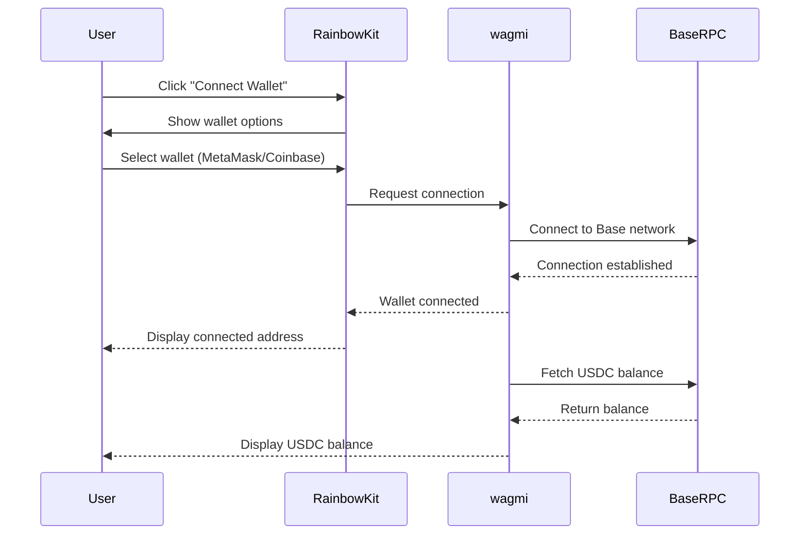
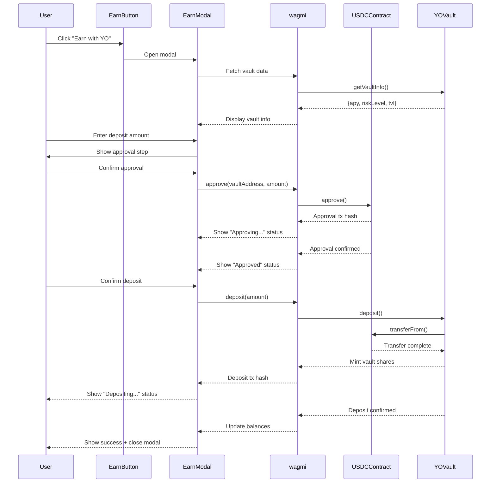
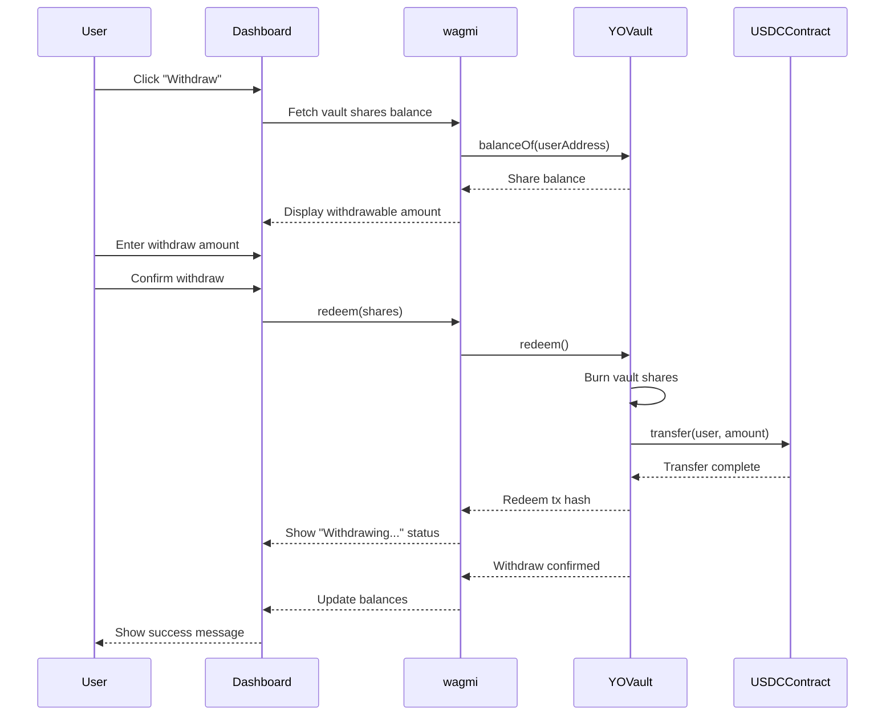

# Design Document: EarnButton - YO Protocol DeFi Yield Product

## Overview

EarnButton is a user-friendly DeFi yield product that enables users to deposit USDC into YO Protocol vaults on Base network and earn passive yield. The application provides a streamlined interface for wallet connection, vault deposits/withdrawals, and real-time portfolio tracking with transparency into fund deployment across DeFi protocols.

The frontend is built with Next.js 14 (App Router), TypeScript, and integrates with YO Protocol SDK for vault interactions. Users connect via RainbowKit, view available vaults with APY and risk metrics, deposit USDC through an intuitive modal flow, and monitor their earnings through a comprehensive dashboard. The design emphasizes simplicity and transparency, presenting complex DeFi operations through a modern fintech interface inspired by Robinhood's clean aesthetic.

## Architecture

```mermaid
graph TD
    A[User Browser] --> B[Next.js App Router]
    B --> C[React Components Layer]
    C --> D[EarnButton]
    C --> E[EarnModal]
    C --> F[Dashboard]
    C --> G[VaultInfo]
    C --> H[TransparencyPanel]
    
    C --> I[Hooks Layer]
    I --> J[useYOVaults]
    I --> K[useDeposit]
    I --> L[useWithdraw]
    I --> M[useBalance]
    
    I --> N[Web3 Integration Layer]
    N --> O[RainbowKit/wagmi]
    N --> P[@yo-protocol/react]
    N --> Q[@yo-protocol/core]
    
    O --> R[Base Network RPC]
    P --> S[YO Protocol Contracts]
    Q --> S
    
    S --> T[USDC Token Contract]
    S --> U[YO Vault Contracts]
    
    style A fill:#e1f5ff
    style B fill:#fff4e1
    style C fill:#f0e1ff
    style N fill:#e1ffe1
    style S fill:#ffe1e1
```

## Sequence Diagrams

### Wallet Connection Flow



### Deposit Flow



### Withdraw Flow



## Components and Interfaces

### Component 1: EarnButton

**Purpose**: Primary call-to-action button that opens the deposit modal

**Interface**:
```typescript
interface EarnButtonProps {
  disabled?: boolean
  className?: string
  onOpenModal: () => void
}

const EarnButton: React.FC<EarnButtonProps>
```

**Responsibilities**:
- Display prominent "Earn with YO" button
- Handle click events to open deposit modal
- Show disabled state when wallet not connected
- Apply Tailwind styling for modern fintech aesthetic

### Component 2: EarnModal

**Purpose**: Modal dialog for depositing USDC into YO vaults

**Interface**:
```typescript
interface EarnModalProps {
  isOpen: boolean
  onClose: () => void
  vaultAddress: string
}

interface DepositState {
  amount: string
  step: 'input' | 'approving' | 'approved' | 'depositing' | 'success' | 'error'
  txHash?: string
  error?: string
}

const EarnModal: React.FC<EarnModalProps>
```

**Responsibilities**:
- Display vault information (APY, risk level, name)
- Handle deposit amount input with validation
- Manage two-step transaction flow (approve + deposit)
- Show transaction status and progress indicators
- Display transaction hashes with Basescan links
- Handle errors gracefully with user-friendly messages
- Close modal on successful deposit

### Component 3: VaultInfo

**Purpose**: Display detailed information about a YO Protocol vault

**Interface**:
```typescript
interface VaultInfoProps {
  vaultAddress: string
  showDetails?: boolean
}

interface VaultData {
  name: string
  apy: number
  riskLevel: 'Low' | 'Medium' | 'High'
  tvl: bigint
  strategy: string
  protocolAllocations: ProtocolAllocation[]
}

interface ProtocolAllocation {
  protocol: string
  percentage: number
  amount: bigint
}

const VaultInfo: React.FC<VaultInfoProps>
```

**Responsibilities**:
- Fetch and display vault metadata
- Show APY with visual emphasis
- Display risk level with color coding
- Show total value locked (TVL)
- Render protocol allocation breakdown
- Update data in real-time

### Component 4: Dashboard

**Purpose**: User portfolio overview showing deposits, earnings, and performance

**Interface**:
```typescript
interface DashboardProps {
  userAddress: string
}

interface PortfolioData {
  totalDeposited: bigint
  currentValue: bigint
  yieldEarned: bigint
  currentApy: number
  positions: VaultPosition[]
}

interface VaultPosition {
  vaultAddress: string
  vaultName: string
  depositedAmount: bigint
  currentValue: bigint
  shares: bigint
  apy: number
  depositedAt: number
}

const Dashboard: React.FC<DashboardProps>
```

**Responsibilities**:
- Display total portfolio value
- Show aggregate yield earned
- Calculate and display weighted average APY
- List individual vault positions
- Provide withdraw functionality for each position
- Show historical performance (if time permits)
- Auto-refresh data periodically

### Component 5: TransparencyPanel

**Purpose**: Show detailed breakdown of fund deployment across DeFi protocols

**Interface**:
```typescript
interface TransparencyPanelProps {
  vaultAddress: string
}

interface FundDeployment {
  protocol: string
  strategy: string
  allocation: bigint
  percentage: number
  apy: number
  riskLevel: 'Low' | 'Medium' | 'High'
}

const TransparencyPanel: React.FC<TransparencyPanelProps>
```

**Responsibilities**:
- Fetch vault strategy details from YO Protocol
- Display protocol-by-protocol allocation breakdown
- Show percentage and absolute amounts
- Visualize allocations with charts/bars
- Explain strategy in user-friendly terms
- Update when vault rebalances

## Data Models

### VaultMetadata

```typescript
interface VaultMetadata {
  address: string
  name: string
  symbol: string
  apy: number
  riskLevel: 'Low' | 'Medium' | 'High'
  tvl: bigint
  strategy: string
  underlyingAsset: string
  minDeposit: bigint
  maxDeposit: bigint
  depositFee: number
  withdrawalFee: number
  performanceFee: number
}
```

**Validation Rules**:
- address must be valid Ethereum address
- apy must be non-negative number
- riskLevel must be one of: 'Low', 'Medium', 'High'
- tvl, minDeposit, maxDeposit must be non-negative bigint
- fees must be between 0 and 100 (percentage)

### UserPosition

```typescript
interface UserPosition {
  vaultAddress: string
  userAddress: string
  shares: bigint
  depositedAmount: bigint
  currentValue: bigint
  yieldEarned: bigint
  depositedAt: number
  lastUpdated: number
}
```

**Validation Rules**:
- vaultAddress and userAddress must be valid Ethereum addresses
- shares, depositedAmount, currentValue, yieldEarned must be non-negative bigint
- depositedAt and lastUpdated must be valid Unix timestamps
- currentValue should be >= depositedAmount (unless vault has losses)

### TransactionStatus

```typescript
interface TransactionStatus {
  type: 'approve' | 'deposit' | 'withdraw'
  status: 'pending' | 'confirming' | 'success' | 'error'
  txHash?: string
  error?: string
  timestamp: number
}
```

**Validation Rules**:
- type must be one of: 'approve', 'deposit', 'withdraw'
- status must be one of: 'pending', 'confirming', 'success', 'error'
- txHash must be valid transaction hash when status is not 'pending'
- error must be present when status is 'error'
- timestamp must be valid Unix timestamp

### ProtocolAllocation

```typescript
interface ProtocolAllocation {
  protocol: string
  strategy: string
  allocation: bigint
  percentage: number
  apy: number
  riskLevel: 'Low' | 'Medium' | 'High'
  lastRebalance: number
}
```

**Validation Rules**:
- protocol must be non-empty string
- allocation must be non-negative bigint
- percentage must be between 0 and 100
- sum of all percentages in a vault must equal 100
- apy must be non-negative number
- riskLevel must be one of: 'Low', 'Medium', 'High'
- lastRebalance must be valid Unix timestamp

## Hooks Layer

### useYOVaults

```typescript
interface UseYOVaultsReturn {
  vaults: VaultMetadata[]
  isLoading: boolean
  error: Error | null
  refetch: () => Promise<void>
}

function useYOVaults(): UseYOVaultsReturn
```

**Purpose**: Fetch and manage YO Protocol vault data

**Responsibilities**:
- Fetch available vaults from YO Protocol
- Cache vault data
- Handle loading and error states
- Provide refetch functionality

### useDeposit

```typescript
interface UseDepositParams {
  vaultAddress: string
  amount: bigint
}

interface UseDepositReturn {
  deposit: (params: UseDepositParams) => Promise<void>
  approve: (params: UseDepositParams) => Promise<void>
  isApproving: boolean
  isDepositing: boolean
  approvalTxHash?: string
  depositTxHash?: string
  error: Error | null
}

function useDeposit(): UseDepositReturn
```

**Purpose**: Handle USDC approval and vault deposit transactions

**Responsibilities**:
- Execute USDC approval transaction
- Execute vault deposit transaction
- Track transaction states
- Return transaction hashes
- Handle errors

### useWithdraw

```typescript
interface UseWithdrawParams {
  vaultAddress: string
  shares: bigint
}

interface UseWithdrawReturn {
  withdraw: (params: UseWithdrawParams) => Promise<void>
  isWithdrawing: boolean
  txHash?: string
  error: Error | null
}

function useWithdraw(): UseWithdrawReturn
```

**Purpose**: Handle vault share redemption and USDC withdrawal

**Responsibilities**:
- Execute redeem transaction
- Track transaction state
- Return transaction hash
- Handle errors

### useBalance

```typescript
interface UseBalanceParams {
  address: string
  token: 'USDC' | 'vault'
  vaultAddress?: string
}

interface UseBalanceReturn {
  balance: bigint
  formatted: string
  isLoading: boolean
  error: Error | null
  refetch: () => Promise<void>
}

function useBalance(params: UseBalanceParams): UseBalanceReturn
```

**Purpose**: Fetch and format token balances (USDC or vault shares)

**Responsibilities**:
- Fetch token balance for user
- Format balance with proper decimals
- Handle loading and error states
- Provide refetch functionality
- Support both USDC and vault share balances

## Error Handling

### Error Scenario 1: Wallet Not Connected

**Condition**: User attempts to interact with app without connecting wallet
**Response**: Disable all interactive elements, show "Connect Wallet" prompt
**Recovery**: User connects wallet via RainbowKit

### Error Scenario 2: Insufficient USDC Balance

**Condition**: User attempts to deposit more USDC than they have
**Response**: Show error message "Insufficient USDC balance", disable deposit button
**Recovery**: User reduces deposit amount or acquires more USDC

### Error Scenario 3: Transaction Rejection

**Condition**: User rejects transaction in wallet
**Response**: Show error message "Transaction rejected by user", reset modal state
**Recovery**: User can retry transaction

### Error Scenario 4: Transaction Failure

**Condition**: Transaction fails on-chain (e.g., slippage, gas issues)
**Response**: Show error message with reason, display transaction hash for debugging
**Recovery**: User can retry with adjusted parameters

### Error Scenario 5: Network Mismatch

**Condition**: User wallet is connected to wrong network (not Base)
**Response**: Show prominent warning "Please switch to Base network", provide switch button
**Recovery**: User switches network via RainbowKit or wallet

### Error Scenario 6: RPC Connection Failure

**Condition**: Cannot connect to Base RPC endpoint
**Response**: Show error message "Network connection issue, please try again"
**Recovery**: Automatic retry with exponential backoff, user can manually refresh

### Error Scenario 7: Vault Data Fetch Failure

**Condition**: Cannot fetch vault metadata from YO Protocol
**Response**: Show loading skeleton with error state, provide retry button
**Recovery**: User clicks retry, or automatic retry after timeout

### Error Scenario 8: Approval Already Exists

**Condition**: User has already approved USDC for vault
**Response**: Skip approval step, proceed directly to deposit
**Recovery**: N/A - this is expected behavior

## Testing Strategy

### Unit Testing Approach

Test individual components and hooks in isolation using Jest and React Testing Library:

**Component Tests**:
- EarnButton: Render states (enabled/disabled), click handlers, styling
- EarnModal: Modal open/close, form validation, step transitions, error display
- VaultInfo: Data display, loading states, error states
- Dashboard: Portfolio calculations, position rendering, withdraw functionality
- TransparencyPanel: Allocation display, percentage calculations

**Hook Tests**:
- useYOVaults: Data fetching, caching, error handling, refetch
- useDeposit: Approval flow, deposit flow, transaction tracking, error handling
- useWithdraw: Withdrawal flow, transaction tracking, error handling
- useBalance: Balance fetching, formatting, refetch

**Utility Tests**:
- Format functions (formatUSDC, formatAPY, formatAddress)
- Calculation functions (calculateYield, calculateWeightedAPY)
- Validation functions (validateAmount, validateAddress)

**Coverage Goals**: 80%+ code coverage for critical paths

### Property-Based Testing Approach

Use fast-check library for property-based testing of core business logic:

**Property Test Library**: fast-check

**Properties to Test**:

1. **Deposit Amount Calculations**:
   - Property: For any valid deposit amount, shares received should be proportional to vault exchange rate
   - Generator: Arbitrary positive bigints within valid range

2. **Yield Calculations**:
   - Property: Yield earned should always equal currentValue - depositedAmount
   - Generator: Arbitrary vault positions with varying time periods

3. **APY Calculations**:
   - Property: Weighted average APY should be between min and max individual vault APYs
   - Generator: Arbitrary arrays of vault positions with different APYs

4. **Percentage Allocations**:
   - Property: Sum of protocol allocation percentages should always equal 100
   - Generator: Arbitrary arrays of protocol allocations

5. **Balance Formatting**:
   - Property: Formatting and parsing should be inverse operations (format(parse(x)) === x)
   - Generator: Arbitrary bigint values

6. **Transaction State Transitions**:
   - Property: Transaction status should follow valid state machine transitions
   - Generator: Arbitrary sequences of transaction events

### Integration Testing Approach

Test component interactions and data flow using Playwright:

**Integration Test Scenarios**:

1. **End-to-End Deposit Flow**:
   - Connect wallet → View vaults → Open modal → Approve USDC → Deposit → View dashboard
   - Verify state updates at each step
   - Check transaction confirmations

2. **End-to-End Withdraw Flow**:
   - View dashboard → Select position → Withdraw → Confirm transaction → Verify balance update

3. **Multi-Vault Interaction**:
   - Deposit into multiple vaults
   - Verify dashboard shows all positions correctly
   - Verify total calculations are accurate

4. **Error Recovery Flows**:
   - Test transaction rejection recovery
   - Test network switch recovery
   - Test RPC failure recovery

5. **Real-Time Data Updates**:
   - Verify dashboard updates when vault APY changes
   - Verify balance updates after transactions
   - Verify transparency panel updates on rebalance

**Test Environment**: Use Base testnet (Sepolia) with test USDC and YO Protocol test vaults

## Performance Considerations

**Data Fetching Optimization**:
- Use SWR or React Query for caching vault data
- Implement stale-while-revalidate pattern for balance updates
- Batch multiple contract calls using multicall
- Cache vault metadata for 5 minutes, balance data for 30 seconds

**Rendering Optimization**:
- Use React.memo for expensive components (Dashboard, TransparencyPanel)
- Implement virtual scrolling for large vault lists (if needed)
- Lazy load modal components
- Optimize re-renders with proper dependency arrays

**Transaction Performance**:
- Use gas estimation before transactions
- Implement transaction queueing to prevent nonce conflicts
- Show optimistic UI updates before confirmation
- Use WebSocket for real-time transaction updates

**Bundle Size**:
- Code split by route (Next.js automatic)
- Lazy load heavy dependencies (@yo-protocol/core)
- Tree-shake unused wagmi/viem functions
- Target: < 200KB initial bundle

**Target Metrics**:
- First Contentful Paint: < 1.5s
- Time to Interactive: < 3s
- Largest Contentful Paint: < 2.5s
- Transaction confirmation feedback: < 500ms

## Security Considerations

**Smart Contract Interactions**:
- Validate all user inputs before sending transactions
- Use exact amount approvals (not infinite approvals)
- Verify contract addresses against official YO Protocol registry
- Implement slippage protection for deposits/withdrawals
- Display clear warnings for high-risk vaults

**Frontend Security**:
- Sanitize all user inputs to prevent XSS
- Use Content Security Policy headers
- Implement rate limiting for RPC calls
- Never store private keys or sensitive data
- Use HTTPS only for all connections

**Transaction Security**:
- Show clear transaction previews before signing
- Display gas estimates and total costs
- Warn users about high gas prices
- Implement transaction simulation before execution
- Verify transaction success on-chain before showing success UI

**Data Validation**:
- Validate all data from RPC endpoints
- Verify vault addresses are legitimate YO Protocol vaults
- Check for reentrancy in transaction flows
- Validate APY and yield calculations server-side (if backend added)

**User Protection**:
- Implement deposit limits for new vaults
- Show clear risk warnings for high-risk strategies
- Provide emergency withdrawal functionality
- Display audit status of vaults
- Link to YO Protocol documentation and audits

## Dependencies

**Core Framework**:
- next@14.x (App Router)
- react@18.x
- typescript@5.x

**Web3 Integration**:
- @yo-protocol/react@latest
- @yo-protocol/core@latest
- wagmi@2.x
- viem@2.x
- @rainbow-me/rainbowkit@2.x

**Styling**:
- tailwindcss@3.x
- @tailwindcss/forms
- @tailwindcss/typography

**State Management & Data Fetching**:
- swr@2.x (or @tanstack/react-query@5.x)

**Utilities**:
- date-fns (date formatting)
- numeral (number formatting)
- clsx (conditional classnames)

**Development**:
- @types/react
- @types/node
- eslint
- prettier
- jest
- @testing-library/react
- @testing-library/jest-dom
- fast-check (property-based testing)
- playwright (E2E testing)

**Deployment**:
- vercel (hosting platform)

**External Services**:
- Base RPC endpoint (Alchemy or Infura)
- Basescan API (transaction verification)
- YO Protocol contracts on Base mainnet

## Correctness Properties

*A property is a characteristic or behavior that should hold true across all valid executions of a system—essentially, a formal statement about what the system should do. Properties serve as the bridge between human-readable specifications and machine-verifiable correctness guarantees.*

### Property 1: Vault Information Completeness

*For any* vault metadata object, when rendered in the UI, the output SHALL contain vault name, APY, risk level, and TVL.

**Validates: Requirements 2.2**

### Property 2: Risk Level Color Consistency

*For any* risk level value (Low, Medium, or High), the system SHALL map it to a distinct, consistent color code (green for Low, yellow for Medium, red for High).

**Validates: Requirements 2.3, 9.7**

### Property 3: Deposit Amount Validation

*For any* deposit amount and user USDC balance, the validation function SHALL return true if and only if the amount is a positive number not exceeding the balance.

**Validates: Requirements 3.3, 8.1, 8.2**

### Property 4: Deposit Balance Update Consistency

*For any* successful deposit transaction of amount A, the user's USDC balance SHALL decrease by A and their vault share balance SHALL increase proportionally to the vault's exchange rate.

**Validates: Requirements 3.10**

### Property 5: Withdrawal Amount Validation

*For any* withdrawal amount and user vault share balance, the validation function SHALL return true if and only if the amount is a positive number not exceeding the share balance.

**Validates: Requirements 4.3, 8.3**

### Property 6: Withdrawal Balance Update Consistency

*For any* successful withdrawal transaction redeeming S shares, the user's vault share balance SHALL decrease by S and their USDC balance SHALL increase by the USDC value of those shares.

**Validates: Requirements 4.7**

### Property 7: Portfolio Total Deposited Calculation

*For any* set of vault positions, the total deposited amount SHALL equal the sum of deposited amounts across all individual positions.

**Validates: Requirements 5.1**

### Property 8: Portfolio Total Value Calculation

*For any* set of vault positions, the total current value SHALL equal the sum of current values across all individual positions.

**Validates: Requirements 5.2**

### Property 9: Yield Calculation Correctness

*For any* portfolio with total current value V and total deposited amount D, the yield earned SHALL equal V - D.

**Validates: Requirements 5.3**

### Property 10: Weighted Average APY Bounds

*For any* set of vault positions with individual APYs, the weighted average APY SHALL be greater than or equal to the minimum individual APY and less than or equal to the maximum individual APY.

**Validates: Requirements 5.4**

### Property 11: Position Display Completeness

*For any* vault position, when rendered in the dashboard, the output SHALL contain vault name, deposited amount, current value, shares, and APY.

**Validates: Requirements 5.5**

### Property 12: Protocol Allocation Completeness

*For any* protocol allocation, when rendered in the transparency panel, the output SHALL contain protocol name, strategy description, allocation amount, percentage, APY, and risk level.

**Validates: Requirements 6.2, 6.3**

### Property 13: Allocation Percentage Sum Invariant

*For any* set of protocol allocations within a single vault, the sum of all allocation percentages SHALL equal 100.

**Validates: Requirements 6.4**

### Property 14: Transaction Type Display

*For any* transaction (approve, deposit, or withdraw), when displayed in the UI, the transaction type SHALL be clearly indicated.

**Validates: Requirements 7.1**

### Property 15: Transaction Hash Link Format

*For any* transaction hash, when rendered in the UI, it SHALL be formatted as a clickable link to the corresponding Basescan transaction page.

**Validates: Requirements 7.3**

### Property 16: Transaction Timestamp Presence

*For any* transaction status display, the output SHALL include a timestamp indicating when the transaction occurred.

**Validates: Requirements 7.7**

### Property 17: Ethereum Address Validation

*For any* string input, the address validation function SHALL return true if and only if the string is a valid 42-character hexadecimal string starting with "0x".

**Validates: Requirements 8.7**

### Property 18: USDC Amount Formatting

*For any* USDC amount value, the formatting function SHALL produce a string with exactly 2 decimal places and comma separators for thousands.

**Validates: Requirements 9.1**

### Property 19: APY Formatting

*For any* APY value, the formatting function SHALL produce a string with exactly 2 decimal places followed by a "%" symbol.

**Validates: Requirements 9.2**

### Property 20: Address Truncation Correctness

*For any* valid Ethereum address, the truncation function SHALL produce a string showing the first 6 characters (including "0x") and the last 4 characters, separated by "...".

**Validates: Requirements 9.3**

### Property 21: Large Number Suffix Appropriateness

*For any* number value, the formatting function SHALL apply "K" suffix for thousands (1,000-999,999) and "M" suffix for millions (1,000,000+).

**Validates: Requirements 9.4**

### Property 22: Timestamp Human-Readable Format

*For any* Unix timestamp, the formatting function SHALL produce a human-readable date string (e.g., "Jan 15, 2024").

**Validates: Requirements 9.5**

### Property 23: Transaction Hash Truncation

*For any* transaction hash, the truncation function SHALL produce a string showing the first 10 characters and the last 8 characters, separated by "...".

**Validates: Requirements 9.6**

### Property 24: Error Recovery Options Presence

*For any* error state displayed to the user, the error message SHALL include actionable recovery steps or a retry option.

**Validates: Requirements 11.7**

### Property 25: Exact Approval Amount

*For any* deposit transaction requiring USDC approval, the approval amount SHALL exactly equal the deposit amount (not infinite approval).

**Validates: Requirements 12.1**

### Property 26: Risk Warning Display

*For any* vault with risk level of Medium or High, when displayed in the UI, a risk warning SHALL be present.

**Validates: Requirements 12.3**

### Property 27: Input Sanitization

*For any* user input string, the sanitization function SHALL escape or remove characters that could be used for XSS attacks (e.g., <, >, &, ", ').

**Validates: Requirements 12.5**
